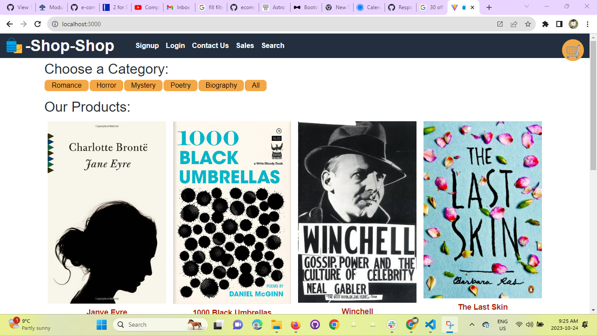

## E-Commerce- Application ##
## Licence:
MIT

## Demo:

## About:
This is an E-Commerce Website build for selling category wise book products online.
In this projects a user can visit the websites, registers and login to the website. They can check all the products available for shopping, filter and search item based on different categories, and then add to cart. They can add multiple item to the cart and also plus or minus the quantity in the cart. Once the cart is updated, the user can proceed to checkout and click the credit card payment details to proceed. Once the payment is success the orders will be placed and users will be able to see the orders details in the orders section.

Note: The payment page is created only for demo purpose and its not fully integrated with any payment gateway. So for now any credit card details will be accepted and the demo orders will be placed.

## Technologies UseTechnologies used:
HTML
CSS
Javascript
React
redux
MongoDB
Database
Graphql
Bootstarp

## Screenshots:

